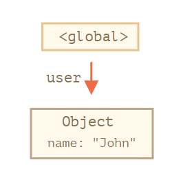
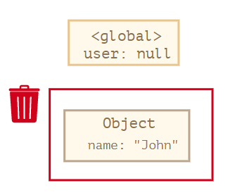
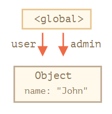
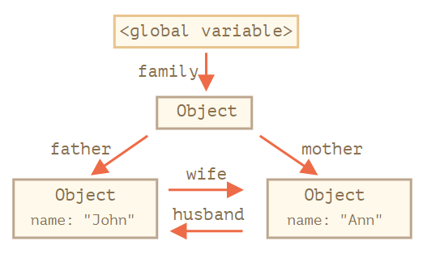
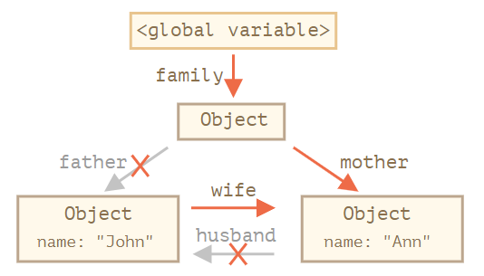
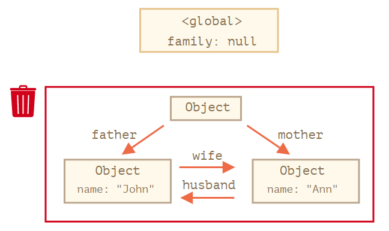
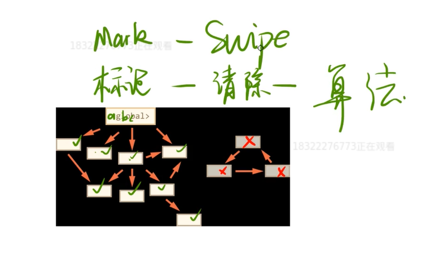
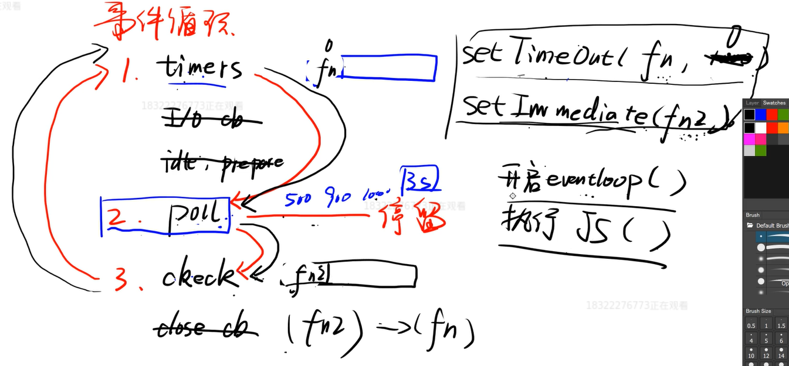
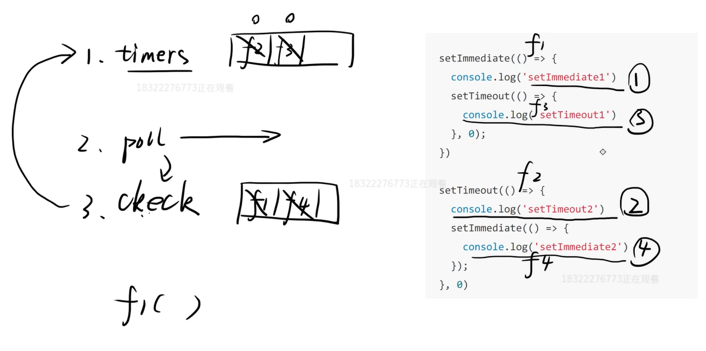

# 开放题和刁钻题

## 什么是 XSS? 如何预防?

含义: XSS(Cross Site Scripting), 即跨站脚本攻击, 是一种常见于 web 应用程序中的计算机安全漏洞

> 存储型: 将恶意脚本存储起来, 比如说评论内容为脚本语言, 在服务器渲染返回的时候会造成浏览器自动解析

> 反射型: 恶意脚本作为请求参数, 在请求路径上加入恶意脚本, 这样就会在返回响应的时候返回

> 文档型: 不会经过服务端, 而是作为中间人, 在数据传输过程中劫持网络包, 修改里面的 html 文档

预防: 只要我们使用 HTML 编码将浏览器需要渲染的信息编码后, 浏览器在渲染 DOM 元素的时候, 会自动解码需要渲染的信息, 将上述信息解析成字符串而不是 JS 脚本, 这就是我们防御 XSS 攻击的核心想法

- 获取用户的输入, 不用 innerHtml,用 innerText
- 利用 CSP, 限制其他域下的资源加载, 禁止向其他域提交信息, 提供上报机制
- 对用户的输入进行过滤, 如对& < > " ' /等进行转义

## Cookie 如果防范 XSS 攻击?

httponly 这个属性可以防止 XSS 攻击, 它会禁止 js 脚本来访问 Cookie

secure 这个属性告诉浏览器尽在请求为 https 的时候发送 Cookie

## 一句话概括 RestFul

用 URL 定位资源, 用 HTTP 描述操作

## 什么是 CSRF? 如何预防?

含义: CSRF (Cross Site Request Forgery), 跨站请求伪造, 是利用后台有规律的接口，例如 localhost/deleteAriticle.php?id=3&username=xiaoxiao ，攻击者在被攻击的网站页面嵌入这样的代码，当用户 xiaoxiao 访问该网站的时候，会发起这条请求。服务器会删除 id 为 3 的数据

1. 自动 get 请求
2. 自动 post 请求
3. 诱导法送 get 请求

预防:

- cookie: 设置 samesite 属性, 防止跨域请求
- 客户端: 对于数据库的修改请求, 全部使用 POST 提交, 禁止使用 GET 请求
- 服务端: 一般的做法是在表单里面添加一段隐藏的唯一的 token(请求令牌)

## 你遇到最难的问题?

开放性问题, 讲究一波三折

举个例子:
:::tip 注意 例子 1
做 PointUI 的轮子时, 单元测试配置 karma.config 时一直打不开浏览器进行测试,
该开始从网上搜了解决方案, 试了都不成功, 重写下载了 node_modules 好几次, 还是不行, 后来找答案到想放弃写单元测试了, 然后纠结了半天,
还是继续在网上找答案, 因为单元测试会为以后的代码重构打很好的基础, 后来经过好几次的排错, 终于在 Stack Overflow 上找出了正解
:::

:::tip 注意 例子 2
在做小猫记账的时候, 做统计页面引入 Echarts, 后来在数据动态变化的时候 Echarts 一直渲染不成功, 后来以为是钩子函数的问题, 换了好几次钩子函数,
还是不行, 网上搜了一些方法也没有作用, 后来突然有了灵感, 是不是 Echarts 的问题, 后来网上尝试着搜了一下, 确实有 Echarts 的及时渲染问题, 所以我靠这个解决了统计页面的 Echart 渲染问题
:::

## 你在团队的突出贡献是什么?

- 目前还是学生, 所有项目都是自己开发

## 最近关注什么新技术?

- 多看 阮一峰 尤雨溪 还有其他的前端大佬

## 有没有看过一些源码, 看了之后有什么记忆深刻的地方, 有什么收获?

- 这个问题等看了源码会写

## 刁钻题目(其实就是 JS 的 bug)

### 代码

```js
;[1, 2, 3].map(parseInt) // 1 NaN NaN
```

:::danger 危险
具体步骤是这样的, 所以会出现上述结果

parInt('1',0)

parInt('2',1)

parInt('3',2)
:::

### 代码

```js
var a = { name: 'a' }
a.x = a = {}
// a.x = undefined
```


### (a ==1 && a== 2 && a==3) 可能为 true 吗？

- 利用 == (两个等于号, 两头参数不一样的话就会自动调用 valueOf 方法)会调用 valueOf() 的特性

```js
let a = {
  value: 1,
  valueOf() {
    return this.value++
  },
}
a == 1 && a == 2 && a == 3 // true
```

- 利用 a 会读取 window.a 的特性

```js
var value = 1
Object.defineProperty(window, 'a', {
  get() {
    return value++
  },
})
a == 1 && a == 2 && a == 3 // true
// 或者
a === 1 && a === 2 && a === 3 // true
```

## 超纲题

### JS 垃圾回收

- 什么是垃圾
  - 不再需要, 即为垃圾
  - 所有变量都有生命周期
  - 没有被引用的对象可能是垃圾(双引用)
  - 三个对象互相引用, 那也有可能是垃圾(环)

> 举例子

#### 全局变量引用一个对象

```js
let user = {
  name: 'John',
}
```



当把 user 重写

```js
user = null
```



#### 两个变量引用一个对象

```js
let user = {
  name: 'John',
}

let admin = user
```



当把 user 重写

```js
user = null
```

这样的话, 对象还是存在的, 它还被 admin 引用的, 所以不会被垃圾回收

#### 引用环

```js
function marry(man, woman) {
  woman.husband = man
  man.wife = woman

  return {
    father: man,
    mother: woman,
  }
}

let family = marry(
  {
    name: 'John',
  },
  {
    name: 'Ann',
  }
)
```



去除两个引用

```js
delete family.father
delete family.mother.husband
```



你会看到 family 和 mother 都消除了对 father 的引用, 所以


### 引用环的孤岛

继续引用环的代码

```js
family = null
```



可以看到, 虽然孤岛里的都有相互引用, 但是与他们连接的 family 断开了连接, 所以这个引用孤岛也要被垃圾回收

:::tip 注意

1. 如果全局变量基本不会消除
2. 局部变量, 在执行后就消除
3. 如果存在双引用, 删除一个, 其中一个还有
4. 环引用, 只要存在相互引用, 就不会消除
5. 不合群就消除, 需要有桥梁连接外界
   :::

> 如何捡垃圾? --- 垃圾回收算法

1. 标记清除算法

全局作用域开始把所有用到的对象都标记一下, 一直标记到没有被引用的变量王为止



- 缺点: 时间太长, 每一个都要标记遍历

- 优化:
  - 新生代和老一代
  - 增量收集
  - 空闲时间收集

> 前端的特性: 有 DOM 进程和 JS 进程, 如果把 DOM 元素指为 null, 那么也应该删除 DOM 元素

```js
div.remove()
div.onclick = null // 这句兼容 IE
div = null
```

2. 标记压缩算法

和“标记－清除”相似, 不过在标记阶段后它将所有活动对象紧密的排在堆的一侧(压缩), 消除了内存碎片, 不过压缩是需要花费计算成本的

3. 引用计数算法

引用计数，就是记录每个对象被引用的次数，每次新建对象、赋值引用和删除引用的同时更新计数器，如果计数器值为 0 则直接回收内存

4. 分代回收

- 新生代 = 生成空间 + 2 \* 幸存区 复制算法
- 老年代 标记-清除算法

对象在生成空间创建, 当生成空间满之后进行 minor gc, 将活动对象复制到第一个幸存区, 并增加其“年龄” age, 当这个幸存区满之后再将此次生成空间和这个幸存区的活动对象复制到另一个幸存区, 如此反复, 当活动对象的 age 达到一定次数后将其移动到老年代: 当老年代满的时候就用标记-清除或标记-压缩算法进行 major gc

### EventLoop(事件循环) Node.js 的概念

- 事件: 操作系统给浏览器触发的一个行为
- 操作系统轮询键盘
- 当 JS 执行异步任务时, 发了一个消息给 C++, 执行轮询来监听 AJAX 到底变化了没, 变了就给 JS 发回去事件

#### EventLoop 阶段

1. timers: 执行异步函数
2. I/O callback
3. poll(EventLoop 大部分时间在的阶段): 等待异步时间
4. check: 主要存 setImmediate API
5. close callback **nextTick 当前阶段马上执行**



举例一个面试题



> 宏任务 和 微任务

1. Event Loop
   - Node.js: timers poll check
   - chrome(一会:宏任务, 马上:微任务)
2. Node.js
   - setTimeout ==> timer
   - setImmediate ==> check
   - nextTick ==> 当前队列的后面
3. Chrome

   - setTimeout ==> 一会
   - then(fn) ==> 马上

**一定要画图解题**

#### 总结

EventLoop 是一个阶段, 分为 Node.js 和 Chrome

- Node.js:
  1. timers: setTimeout
  2. poll: 等待
  3. check: setImmediate
  4. 附加 nextTick 强行来说是微任务, 在当前的阶段后面执行
- Chrome:
  1. 宏(一会)
  2. 微(马上)


## 个性化题目

- PWA
- echarts.js / d3.js
- three.js
- flutter
- SSR

写个 HelloWorld 就行

## 操作系统

### 进程和线程的区别

这是操作系统的问题，可以从四方面思考：

1. 线程是程序执行的最小单位，而进程是操作系统分配资源的最小单位。
2. 一个进程由一个或多个线程组成，线程是一个进程中代码的不同执行路线。
3. 进程之间相互独立，但同一进程下的各个线程之间共享程序的内存空间。
4. 调度和切换：线程上下文切换比进程上下文切换要快得多。

- 进程: 是并发执行的程序在执行过程中分配和管理资源的基本单位, 是一个动态概念, 竞争计算机系统资源的基本单位
- 线程: 是进程的一部分, 一个没有线程的进程可以被看作是单线程的, 线程有时又被称为轻权进程或轻量级进程, 也是 CPU 调度的一个基本单位

### 线程哪些资源共享, 哪些资源不共享

共享:

- 堆: 堆在进程空间开辟出来, 所以它理所应当是被共享的, 因为 new 出来的都是共享的
- 全局变量: 它是与具体某一函数无关的, 所以与特定线程无关
- 静态变量: 处于堆中开辟的 .bss 和 .data 段
- 文件等公共资源: 使用这些公共资源的线程必须同步

独享:

- 栈
- 寄存器: 线程存放的是副本, 包括程序计数器 PC

### 进程间通信

1. 无名管道: 半双工的通信方式, 数据只能单向流动且只能在具有亲缘关系的进程间使用
2. 高级管道: 将另一个程序当做一个新的进程在当前程序进程中启动, 则这个进程算是当前程序的子进程
3. 有名管道: 也是半双工管道的通信方式, 但是允许没有亲缘进程之间的通信
4. 消息队列: 消息队列是有消息的链表, 存放在内核中, 并由消息队列标识符标识, 消息队列克服了信号传递信息少, 管道只能承载无格式字节流
   以及缓冲区大小受限的缺点
5. 信号量: 信号量是一个计数器, 可以控制多个进程共享资源的访问, 他作为一种锁机制, 防止某进程正在访问共享资源时, 其他进程也访问该资源
6. 信号: 用于接收进程某个事件已经发生
7. 共享内存: 共享内存就是映射一段能被其他进程所访问的内存, 这段内存由一个进程创建, 但是多个进程可以访问
8. 套接字: 可用于不同机器之间的进程通信

## JS 常用设计模式

### 工厂模式

- 简单工厂模式

```js
// 做咖啡, 做出不同的浓度
function createCoffee(bean, water) {
  const obj = new Object()
  obj.bean = bean
  obj.water = water
  obj.thickness = Math.floor(bean / water)
  return obj
}
const mocha = createCoffee(1, 10)
const american = createCoffee(2, 5)
```

- 复杂工厂模式

```js
function Person() {} // 工厂

Person.prototype.make = function(who, ...args) {
  // 制作物品
  if (typeof this[who] === 'function') {
    const func = this[who]
    function temp() {}
    // 把工厂对象的原型换到工厂上, 所有的物品都是出自工厂而不是各自的实例
    temp.prototype = Person.prototype
    func.prototype = new temp()
    return new func(...args)
  }
}

Person.prototype.extends = function(obj) {
  // 扩展生产线
  for (let key in obj) {
    this[key] = obj[key]
  }
}

Person.prototype.extends({
  boy: function(name) {
    console.log(`I am a boy and name is ${name}`)
  },
  girl: function(name) {
    console.log(`I am a girl and name is ${name}`)
  },
})

const person = new Person()

person.make('boy', 'bob')
```

- 单例模式

```js
function instanceMode() {
  let instance = null
  function createInstance() {
    if (instance) return instance
    instance = this
    this.name = 'chauncey'
    this.age = 11
  }
  const p1 = new createInstance()
  const p2 = new createInstance()
  console.log(p1 === p2)
}
```

- 观察者模式

```js
function observerMode() {
  const EventBus = {
    events: [], // 事件队列
    addEvent: function(eventName, callback) {
      // 添加事件
      if (!this.events[eventName]) {
        this.events[eventName] = []
      }
      const obj = callback
      this.events[eventName].push(obj)
    },
    publishEvent: function(eventName, ...args) {
      // 触发事件
      if (!this.events[eventName]) throw Error('没有注册此事件')
      for (let i = 0; i < this.events[eventName].length; i++) {
        const callback = this.events[eventName][i]
        callback.call(eventName, eventName, ...args)
      }
    },
  }
  EventBus.addEvent('click', (word) => {
    console.log('hello', word)
  })
  EventBus.addEvent('keyup', (word) => {
    console.log('hello', word)
  })
  EventBus.addEvent('keyup', (word) => {
    console.log('hello', word)
  })
  EventBus.publishEvent('click')
  EventBus.publishEvent('keyup')
}
```

- 策略模式

根据不同的应用场景用不同的策略

```js
function strategyMode() {
  const strategy = {
    slow: function() {
      console.log('慢速')
    },
    quick: function() {
      console.log('快速')
    },
    normal: function() {
      console.log('常速')
    },
  }
  function Run(to, from) {
    this.to = to
    this.from = from
  }
  Run.prototype.speed = function() {
    console.log(`${this.from} to ${this.to}`)
  }
  const r = new Run(0, 20)
  r.speed()
}
```
