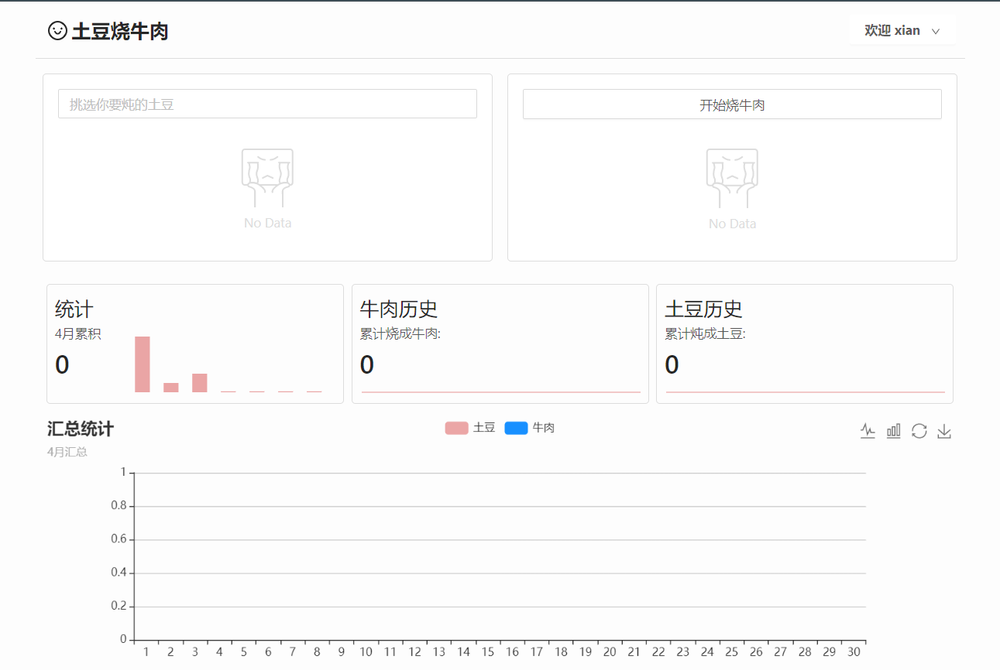

# 土豆炖牛肉介绍

一个含有 todoList 和计时目标的单页面应用

运用技术:
- React
- Redux 
- React Router
- TypeScript
- Echarts
- Ant Design of React



预览链接: [https://chaunceym.gitee.io/clock/](https://chaunceym.gitee.io/clock/)

源码链接: [https://gitee.com/chaunceym/clock](https://gitee.com/chaunceym/clock)

## 功能板块

### TodoList 任务

输入任务来标记, 生成任务列表在任务输入的下方, 有是否完成选择框和任务内容

### 计时任务

一个 25 分钟的任务计时器, 当你开始一个任务时, 可以中断任务, 当完成一个任务时, 可以输入完成任务的内容

任务列表和时间都在输入的下方显示

### 统计

统计 TodoList 任务和计时任务完成的数据

### 牛肉历史

统计 计时任务完成的数据和打断的数据

### 土豆历史 

统计 TodoList 任务完成的数据和删除的数据


## 遇到的问题 

### 如何在让 React Component 监听到外面的 Router 变化?

>首先下载 history 库, 然后封装到一个文件里
```jsx harmony
import { createBrowserHistory } from 'history';

const history = createBrowserHistory();

export default history;
```

>然后在需要 history 的组件里引入
```jsx harmony
import history from "./history.js";
```

>最后在需要监听的组件引入和使用 history
```jsx harmony
import { Router } from "react-router-dom";
import history from "./history.js";

// and then in your JSX:
return (
  <Router history={history}>
    {/* routes as usuall */}
  </Router>
)
```

[原文在 Stack Overflow 上](https://stackoverflow.com/questions/44153517/how-to-access-history-object-outside-of-a-react-component)

### 下载 Node-sass 出错问题?

搜了很久原来是国外版本不一样的问题, 才导致我的 node-sass 一直出错, 后来换成**淘宝源**贼快, 而且安装成功可以使用 scss

[这是一篇 Node-sass 的调错文章](https://www.jianshu.com/p/4609564e31dc)

### Redux 的使用

- state 状态
- action 对 state 做出某些改变的描述
- reducer 是一个函数, 参数为 state 和 action, 相当于一个控制器, 把 action 的描述改为真实逻辑去修改 state

>举例
```html
<!DOCTYPE html>
<html>
  <head>
    <title>Redux basic example</title>
    <script src="https://unpkg.com/redux@latest/dist/redux.min.js"></script>
  </head>
  <body>
    <div>
      <p>
        点击: <span id="value">0</span> 次数
        <button id="increment">+</button>
        <button id="decrement">-</button>
        <button id="incrementIfOdd">如果是奇数，+1</button>
        <button id="incrementAsync">延迟1s +1 </button>
      </p>
    </div>
    <script>
      const reducer = function(state,action){
        if(state === undefined){
          state = 0
        }
        switch(action.type){
          case 'INCREMENT':
            return state + 1;
          case 'DECREMENT':
            return state - 1;
          default:
            return state
        }
      }
      const store = Redux.createStore(reducer)
      const render = function(){
        document.getElementById('value').innerHTML = store.getState()
      }
      
      render()
      
      store.subscribe(render)
      
      const addOne = function(){
        store.dispatch({type: 'INCREMENT'})// 派发 action
      }
      const minusOne = function(){
        store.dispatch({type: 'DECREMENT'})// 派发 action
      }
      document
      .getElementById('increment')
      .addEventListener('click',addOne)
      document
      .getElementById('decrement')
      .addEventListener('click',minusOne)
      document
      .getElementById('incrementIfOdd')
      .addEventListener('click',()=>{
        if(store.getState()%2 === 1){
          addOne()
        }
      })
      document
      .getElementById('incrementAsync')
      .addEventListener('click',()=>{
        setTimeout(addOne,1000)
      })
    </script>
  </body>
</html>
```

### React Hooks 、排序插件和处理日期插件

- [React Hooks](https://reactjs.org/docs/hooks-intro.html)
- [Lodash](https://lodash.com/docs/4.17.15)
- [date-fns](https://date-fns.org/docs/Getting-Started)

::: tip 注意
本项目涉及上面三项技术代码很少, 不过这三个技术的使用起到了关键作用, 根据 get start 就可以快速上手
:::

### 运用 Echarts 图表

1. npm安装echarts-for-react

```bash
npm install --save echarts-for-react
npm install echarts --save 
```

2. 引入模块和组件

```typescript jsx
import echarts from 'echarts' 
import echarts from 'echarts/lib/echarts'

<ReactEcharts option={this.getOption()} />
```

